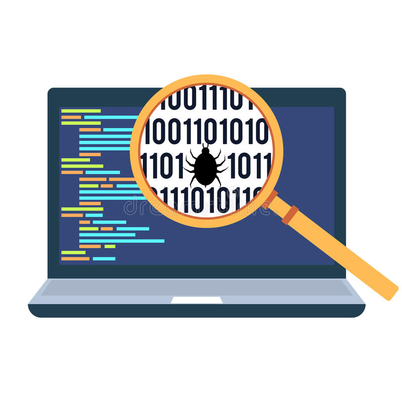

  

Every software system is bound to encounter failures, stemming from a wide range of factors such as bugs, traffic surges, security vulnerabilities, hardware malfunctions, natural disasters, or even human errors. It's important to understand that experiencing setbacks is a common part of software engineering, and these challenges present valuable opportunities for learning and improvement.

A proficient Software Engineer learns from past mistakes to prevent their recurrence. While it's acceptable to face setbacks, encountering the same issue twice due to negligence is not.

In the tech industry, a postmortem serves as a valuable tool. Following any system outage, the responsible team(s) drafts a report with two primary objectives:

1. To offer all employees in the organization easy access to detailed information about the causes of the outage. These outages can significantly impact the company, and it is essential for managers and executives to comprehend what transpired and how it may affect their operations.

2. To ensure that the root causes of the outage are identified and that corrective measures are taken to prevent a recurrence.
